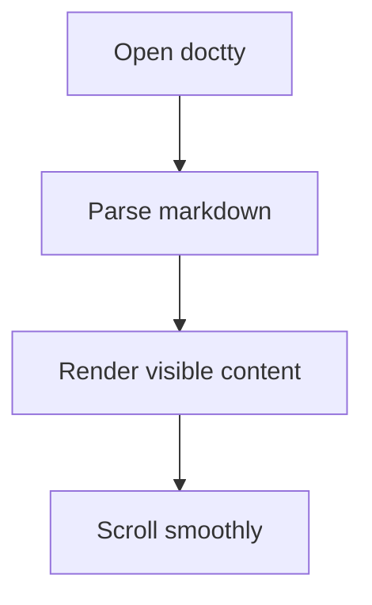
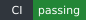
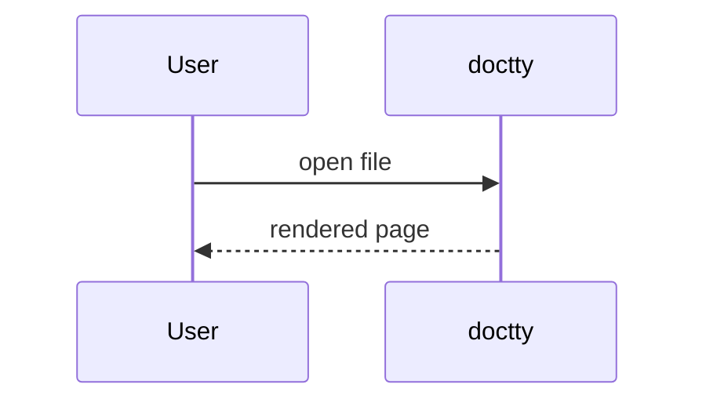
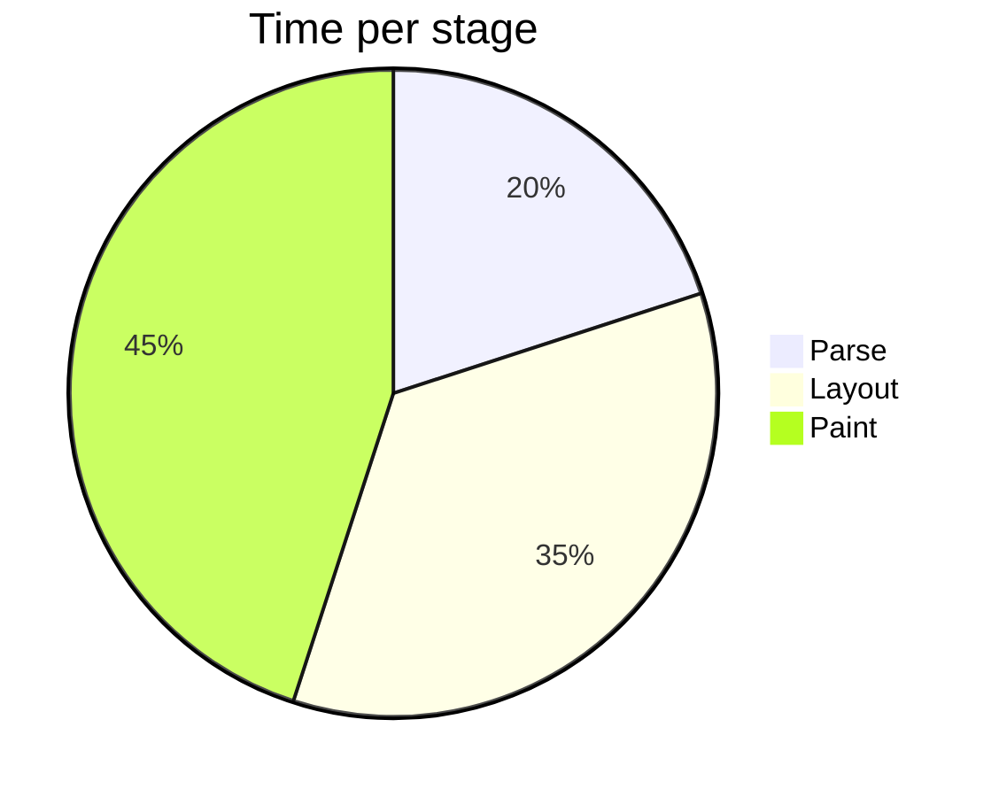

# Mermaid and images

```mermaid
flowchart TD
    Start[Open doctty] --> Parse[Parse markdown]
    Parse --> Render[Render visible content]
    Render --> Scroll[Scroll smoothly]
```

```mermaid
sequenceDiagram
    participant U as User
    participant D as doctty
    U->>D: open file
    D-->>U: rendered page
```

```mermaid
pie title Time per stage
    "Parse" : 20
    "Layout" : 35
    "Paint" : 45
```
